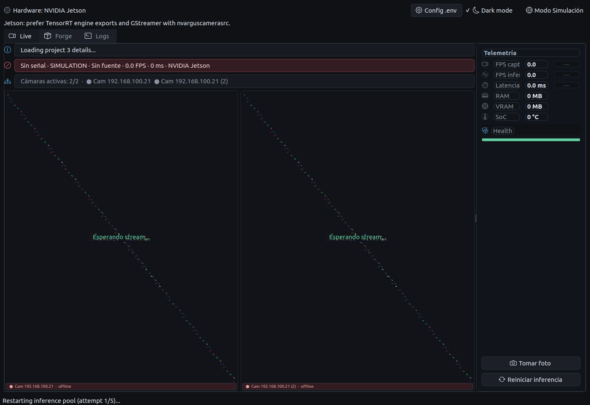
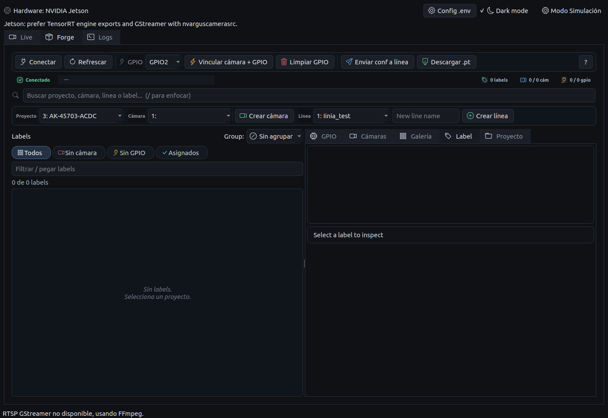
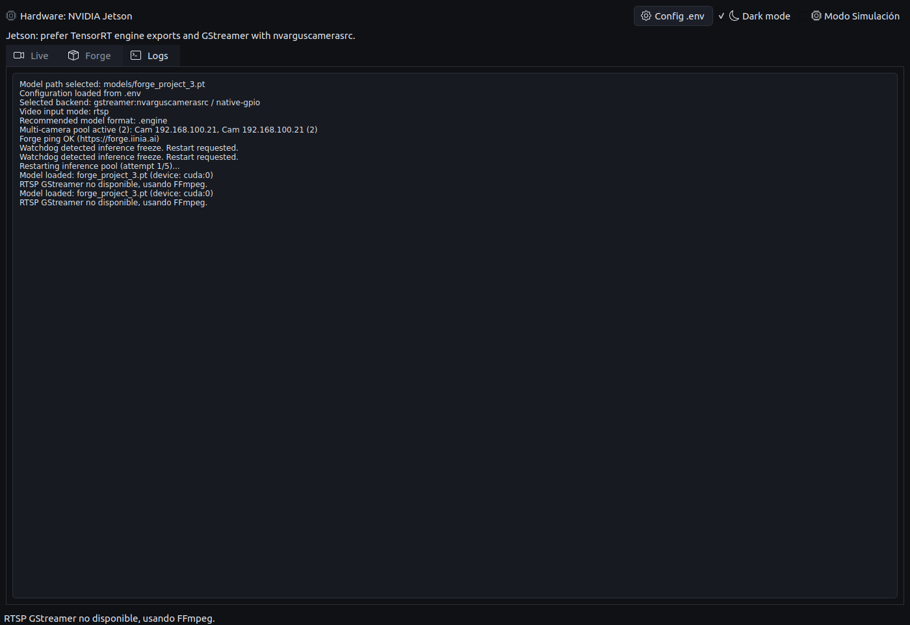

# EdgeVision Control Hub

## Install en Jetson (JetPack 6.1)

```bash
# 1. Dependencias del sistema
sudo apt update && sudo apt install python3-pip -y

# 2. Clonar e instalar (uv descarga Python 3.10 compatible y los wheels CUDA automáticamente)
git clone https://github.com/xavierror656/forge-iinia.git
cd forge-iinia
uv sync

# 3. cuDSS (dependencia de torch 2.10 en Jetson)
wget https://developer.download.nvidia.com/compute/cudss/0.7.1/local_installers/cudss-local-tegra-repo-ubuntu2204-0.7.1_0.7.1-1_arm64.deb
sudo dpkg -i cudss-local-tegra-repo-ubuntu2204-0.7.1_0.7.1-1_arm64.deb
sudo cp /var/cudss-local-tegra-repo-ubuntu2204-0.7.1/cudss-*-keyring.gpg /usr/share/keyrings/
sudo apt-get update && sudo apt-get -y install cudss

# 4. onnxruntime-gpu (solo necesario para exportar modelos a ONNX/TensorRT)
#    Usar pip3 del sistema porque el wheel es cp310 y uv usa Python 3.14
pip3 install https://github.com/ultralytics/assets/releases/download/v0.0.0/onnxruntime_gpu-1.23.0-cp310-cp310-linux_aarch64.whl

# 5. Reboot y correr
sudo reboot
# tras reboot:
uv run python main.py
```

> `uv sync` instala automáticamente `torch 2.10.0` y `torchvision 0.25.0`
> con los wheels CUDA precompilados para JetPack 6.1 (aarch64/cp310).

---

## Install (uv — recomendado)

[uv](https://docs.astral.sh/uv/) instala Python y dependencias en segundos sin necesidad de crear el venv manualmente.

```bash
# 1. Instalar uv (una sola vez por máquina)
curl -LsSf https://astral.sh/uv/install.sh | sh

# 2. Clonar el repo
git clone https://github.com/xavierror656/forge-iinia.git
cd forge-iinia

# 3. Crear entorno e instalar dependencias desde el lock file
uv sync

# 4. Correr la app
uv run python main.py
```

Para instalar también las herramientas de desarrollo (ruff, mypy, pytest):

```bash
uv sync --extra dev
```

Regenerar el lock file cuando cambien las dependencias:

```bash
uv lock
```

---

## Install (venv clásico)

```bash
python3 -m venv .venv
./.venv/bin/python -m pip install -r requirements.lock
```

Para desarrollo:

```bash
./.venv/bin/python -m pip install -e ".[dev]"
./.venv/bin/pre-commit install
```

Lint y tipos:

```bash
./.venv/bin/ruff check core/
./.venv/bin/mypy core/
```

## Run GUI

```bash
uv run python main.py
# o con venv:
./.venv/bin/python main.py
```

## Run headless validation

```bash
QT_QPA_PLATFORM=offscreen uv run python main.py --headless
```

## Config

Copy `.env.example` to `.env` and edit the values:

```bash
cp .env.example .env
```

Use `.env` for:

```bash
FORGE_URL=
FORGE_USERNAME=
FORGE_PASSWORD=
FORGE_TOKEN=
MODEL_DIR=models
CAPTURE_DIR=captures
SIMULATION_MODE=true
```

The GUI loads `FORGE_USERNAME/FORGE_PASSWORD` automatically and uses them for API requests.
In the Forge tab, select a project to load its labels, then pick a GPIO port and assign the selected labels to that port.

Video input is stored in `configs/inference_source.json`. The app will auto-detect USB/CSI cameras on Linux and can be switched to RTSP from the Settings dialog.
Use the RTSP section in Settings to add, remove, and set the default stream.

## Hardware profiles

The app detects the runtime board automatically. You can force a profile with `HARDWARE_OVERRIDE=jetson`, `HARDWARE_OVERRIDE=raspberry`, or `HARDWARE_OVERRIDE=development`.

Jetson:
- Uses the multi-camera UI profile.
- Allows multiple active camera workers.
- Prefers RTSP through GStreamer for lower latency and hardware decode, then falls back to FFmpeg if the GStreamer pipeline is unavailable.

Raspberry Pi:
- Uses the single-camera UI profile.
- Limits inference to one active camera because the board is resource constrained.
- Uses FFmpeg for RTSP instead of GStreamer.

Development:
- Uses the desktop UI profile.
- Keeps multiple cameras available for testing.

## Theme

Set `UI_THEME=dark` or `UI_THEME=light` in `.env`, or switch it from the settings panel. Colors and icons share the same theme tokens so dark/light modes keep readable contrast.

## RTSP notes

RTSP cameras are configured in Settings and saved to `configs/inference_source.json`.

On Jetson, the app first tries this GStreamer path for RTSP streams:

```text
rtspsrc protocols=tcp latency=100 ! rtph264depay ! h264parse ! nvv4l2decoder ! nvvidconv ! videoconvert ! appsink
```

If that fails, it automatically retries the same RTSP URL with FFmpeg. On Raspberry, RTSP starts directly with FFmpeg and only one camera is run.

## Telemetry

Runtime telemetry is collected by `core/telemetry.py` and recorded by `core/telemetry_log.py` into `captures/telemetry.jsonl`.

The UI shows:
- Capture FPS.
- Inference FPS.
- Latency in milliseconds.
- Process RAM usage.
- SOC temperature when the board exposes a thermal sensor.
- Active hardware provider.

Telemetry is sampled from each inference loop and persisted periodically, so screenshots and logs can be matched when debugging performance on Raspberry or Jetson.

## Screenshots for the repo

Recommended location:

```bash
docs/screenshots/
```

Run the app, open the screen you want to document, then capture with one of these options:

```bash
# GNOME screenshot tool
gnome-screenshot -a -f docs/screenshots/live-view.png

# If ImageMagick is installed
import docs/screenshots/settings-panel.png

# Full screen with scrot
scrot docs/screenshots/full-app.png
```

Suggested screenshots:
- `docs/screenshots/live-view.png`: Live tab with video, telemetry and status banners.
- `docs/screenshots/settings-video.png`: Settings dialog showing video source configuration.
- `docs/screenshots/forge-assignments.png`: Forge tab showing labels assigned to camera/GPIO.
- `docs/screenshots/light-theme.png`: Light mode verification.
- `docs/screenshots/dark-theme.png`: Dark mode verification.

Add screenshots to the README with:

```markdown

```

Current dark-mode screenshots:






